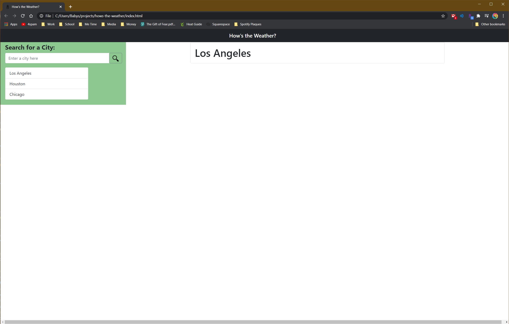
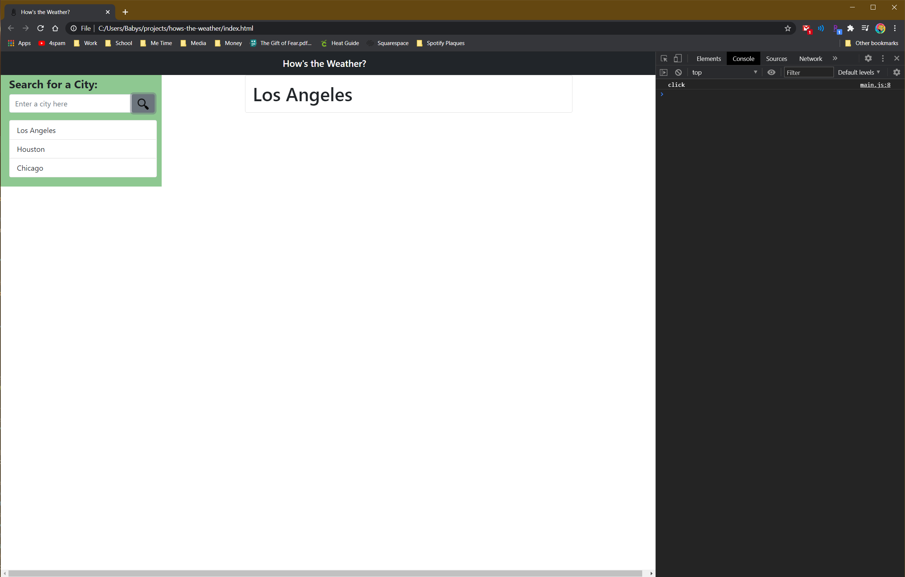

# hows-the-weather

Link to my pretty, but non-functional weather app : 

------------

I thought Javascript was hard, but APIs are even harder.

I started with what I knew best, HTML and CSS. I established the layout I wanted and because it's my strong suit, my set up time is getting faster and faster.

I set up the header/navigation bar, a side bar with an input box and search button. I established a card where the searched city info was going to display. 

After setting up some cities for placeholders to ensure my buttons were clickable, I started on the JS portion.

Truthfully, I began by copying functions out of previous assignments. I understand how they work, but writing them myself has always been difficult. I tend to leave notes within my code not only for others viewing my code, but also for myself just so I can remember what something does. 

I was able to make all the buttons clickable, and the console log confirmed their clickability. However, this is where my knowledge ends. APIs are a completely foreign concept to me and I am still struggling with establishing a connection to an API to acquire the necessary information.

I have a meeting with my tutor this week to hopefully refresh my memory and help me establish an API connection. 

Every time I think I am finally understanding the material, the goal posts move and I feel lost again. 

------------

Screenshots of my pretty, but non-functional weather app : 

